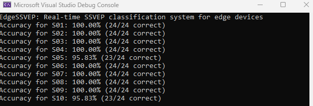

# EdgeSSVEP: A Compact Embedded SSVEP BCI for Ultra-Low-Power Real-Time Applications

This repository contains the dataset, C implementation, and Python verification tools for the paper:

> **EdgeSSVEP: A Compact Embedded SSVEP BCI for Ultra-Low-Power Real-Time Applications**  
> Manh-Dat Nguyen, Xuan-The Tran, Thomas Do, Chin-Teng Lin  
> [TBD], 2025

## Overview

EdgeSSVEP is a project focused on developing a compact, ultra-low-power Brain-Computer Interface (BCI) system for Steady-State Visually Evoked Potential (SSVEP) applications. The repository includes:

- **Datasets**: EEG data organized by subject (S01 to S10) for SSVEP analysis.
- **C Implementation**: Code for processing EEG data and performing SSVEP classification, optimized for embedded systems.
- **Python Verification Tools**: Scripts for validating the results of the C implementation.
- **Results**: Output logs from the SSVEP classification process.

This work aims to enable real-time SSVEP-based BCI applications on resource-constrained devices such as MCU

## Repository Structure

The repository is organized as follows:

```plaintext
EdgeSSVEP/
├── Datasets/                 # Contains XDF dataset files recorded by the EdgeSSVEP device.
├── Processing/               # Holds the C code project for zero-phase bandpass filtering and CCA (Canonical Correlation Analysis) algorithm
├── Results/                  # Includes CCA CSV logs and the console output from the C program
├── Scripts/                  # Contains Python scripts for loading/processing XDF files and extracting raw data into trial files for the C project
└── README.md                 # This file
```
## Getting Started

### Prerequisites
- **Visual Studio 2022 Community**: Recommended for editing, building, and running the C code.
- **Python**: For running verification scripts (version 3.9 or higher recommended).
- **Dependencies**: Ensure required libraries for EEG processing (e.g., pyxdf for XDF file handling, pandas for CSV processing) are installed.

### Installation
1. Clone the repository:
   ```bash
   git clone https://github.com/your-username/EdgeSSVEP.git
   ```
2. Set up your C development environment:
   - Install Visual Studio 2022 Community with the "Desktop development with C++" workload.

### Running the C Code
1. Navigate to `Processing/EdgeSSVEP_Processing`.
2. Open the `Processing/EdgeSSVEP_Processing/EdgeSSVEP_Processing.sln` solution file in Visual Studio 2022
2. Build and run:
   - Press F5 to build and run with debugging, or Ctrl+F5 to run without debugging.
   - A console window will appear, displaying trial-by-trial results and accuracy for subjects S01 to S10
   - Example console output:

   

### Running Python Verification and Extraction:
1. Run the verification script:
   ```bash
   python Scripts/EdgeSSVEP_verify.py
   ```

2. Run the extract script:
   ```bash
   python Scripts/EdgeSSVEP_extract.py
   ```

## Dataset Description
- **Locations**:
  - `Datasets/`: Raw EEG data in XDF format, captured by the EdgeSSVEP device with event markers.
  - `Processing/EdgeSSVEP_Processing/Dataset_txt/`: Converted text files for C code verification.
- **Structure**:
  - `Datasets/`: Contains XDF files (one or more per subject, specific structure depends on the EdgeSSVEP device output).
  - `Dataset_txt/`: Contains 10 folders (S01 to S10), each with 24 trial files (`trial_0.txt` to `trial_23.txt`) generated by `Scripts/EdgeSSVEP_extract.py`.
- **Format**:
  - XDF files in `Datasets/` contain raw EEG data with event markers, as recorded by the EdgeSSVEP device.
  - Text files in `Dataset_txt/` are raw trial data in a format compatible with the C code’s `read_eeg_data` function in the `Processing/EdgeSSVEP_Processing/main.c`
- **Data Conversion**:
  - The `EdgeSSVEP_extract.py` script in `Scripts/` processes XDF files from `Datasets/` and extracts trial data into text files in `Dataset_txt/` for use by the C code.

## Citation

If you use this code or dataset in your research, please cite the following paper:

```bibtex
@article{nguyen2025edgessvep,
  title={EdgeSSVEP: A Compact Embedded SSVEP BCI for Ultra-Low-Power Real-Time Applications},
  author={Nguyen, Manh-Dat and Tran, Xuan-The and Do, Thomas and Lin, Chin-Teng},
  journal={[TBD]},
  year={2025}
}
```

## License
This project is licensed under the MIT License. See the [LICENSE](LICENSE) file for details.

## Contact
For questions or issues, please open an issue on GitHub or contact [manhdatbn93@gmail.com].